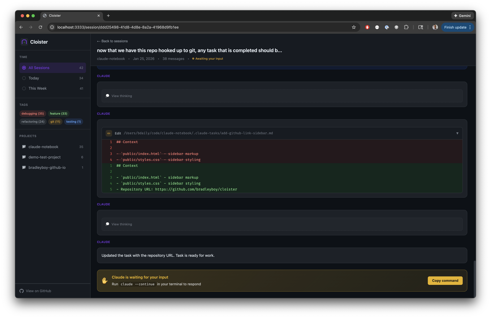

# Cloister

A local web UI for browsing and monitoring your [Claude Code](https://docs.anthropic.com/en/docs/claude-code) conversation history.



## Features

- Browse all your Claude Code sessions organized by project
- **Live monitoring** - Watch active sessions update in real-time via SSE
- **Session status** - See which sessions are working, awaiting input, or idle
- **Keyboard navigation** - Navigate with arrow keys, j/k, Enter, and Escape
- **Lazy loading** - Efficiently handles large sessions with 100+ messages
- Dark theme with GitHub Dark color scheme

## Usage

Run Cloister directly without installing:

```bash
# Using npx (Node.js)
npx cloister

# Using bunx (Bun)
bunx cloister
```

Then open http://localhost:3333 in your browser.

### Options

```bash
cloister --port 8080    # Use a different port
cloister --help         # Show all options
```

## How It Works

Cloister reads session files directly from `~/.claude/projects/` - no database required. It watches for changes and streams updates to your browser, so you can monitor active Claude Code sessions as they happen.

## Development

If you want to contribute to Cloister or run it from source:

```bash
# Clone the repository
git clone https://github.com/bdailey/cloister.git
cd cloister

# Install dependencies
bun install

# Start development server with hot reload (localhost:3333)
bun run dev

# Or start production server
bun run start
```

## Contributing

This project uses Claude-driven development. Instead of traditional issue tracking, we use a task specification system:

### Task System

Tasks live in `.claude-tasks/` as markdown files with a simple format:

```markdown
---
title: Short descriptive title
status: pending
created: 2025-01-25
---

## Problem / Goal
What needs to be done.

## Acceptance Criteria
- [ ] Specific testable outcome
```

### Creating a Task

1. Copy `.claude-tasks/TEMPLATE.md` to a new file
2. Fill in the title, problem description, and acceptance criteria
3. Set `status: pending`

### Running Tasks

Use the autonomous task runner to have Claude complete tasks:

```bash
bun run ralph
```

Or directly:

```bash
./run-tasks.sh
```

This runs Claude in a loop, picking up pending tasks, completing them, and updating the work log until all tasks are done.

You can also run tasks manually with Claude Code:

```bash
claude "Work on the next pending task in .claude-tasks/"
```

### Technical Details

See [CLAUDE.md](./CLAUDE.md) for architecture, code conventions, and implementation details.

## Tech Stack

- **Runtime**: [Bun](https://bun.sh)
- **Server**: [Hono](https://hono.dev) (TypeScript)
- **Frontend**: Vanilla HTML/CSS/JS (no build step)

## License

MIT License

Copyright (c) 2025

Permission is hereby granted, free of charge, to any person obtaining a copy
of this software and associated documentation files (the "Software"), to deal
in the Software without restriction, including without limitation the rights
to use, copy, modify, merge, publish, distribute, sublicense, and/or sell
copies of the Software, and to permit persons to whom the Software is
furnished to do so, subject to the following conditions:

The above copyright notice and this permission notice shall be included in all
copies or substantial portions of the Software.

THE SOFTWARE IS PROVIDED "AS IS", WITHOUT WARRANTY OF ANY KIND, EXPRESS OR
IMPLIED, INCLUDING BUT NOT LIMITED TO THE WARRANTIES OF MERCHANTABILITY,
FITNESS FOR A PARTICULAR PURPOSE AND NONINFRINGEMENT. IN NO EVENT SHALL THE
AUTHORS OR COPYRIGHT HOLDERS BE LIABLE FOR ANY CLAIM, DAMAGES OR OTHER
LIABILITY, WHETHER IN AN ACTION OF CONTRACT, TORT OR OTHERWISE, ARISING FROM,
OUT OF OR IN CONNECTION WITH THE SOFTWARE OR THE USE OR OTHER DEALINGS IN THE
SOFTWARE.
